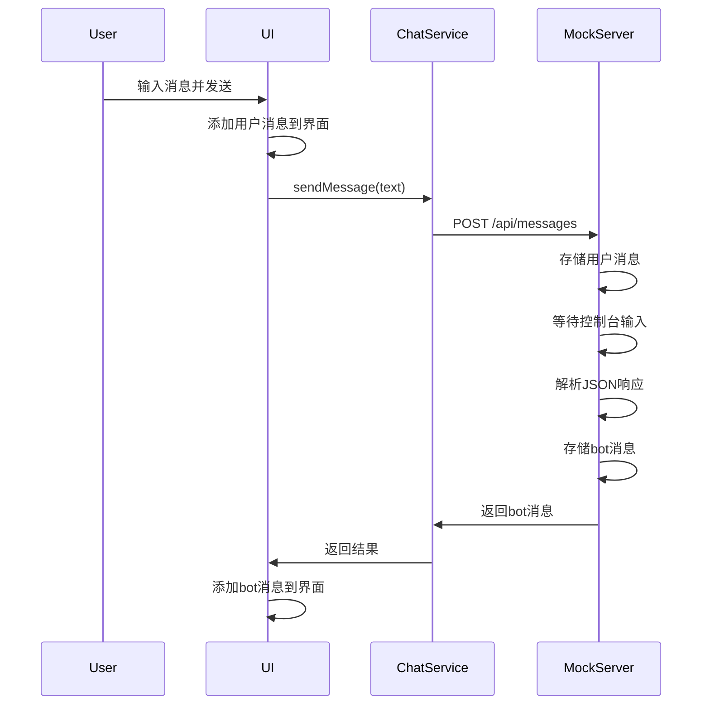

# 现代对话应用技术文档

## 1. 项目启动和使用说明

### 技术栈
- **前端**: Vite + 原生JavaScript + CSS
- **后端**: Express.js Mock服务器
- **构建工具**: Vite
- **样式**: 响应式CSS设计

### 安装依赖
```bash
# 安装项目依赖
npm install
```

### 启动开发服务器
```bash
# 启动Vite开发服务器（前端）
npm run dev
```
开发服务器将在 `http://localhost:5173` 启动

### 启动Mock API服务器
```bash
# 启动Express.js Mock服务器（后端）
npm run mock
```
Mock服务器将在 `http://localhost:3001` 启动

### 构建生产版本
```bash
# 构建生产版本
npm run build
```
构建文件将输出到 `dist/` 目录

### 环境配置
在 `.env` 文件中配置API基础URL：
```env
VITE_API_BASE_URL=http://localhost:3001/api
```

## 2. 登录注册逻辑

### 自动注册/登录流程
系统采用demo用户自动登录机制：

```javascript
// src/js/app.js:18-30
async function init() {
  let result = await register('demo', 'password');
  if (result.error) {
    if (result.error === 'User exists') {
      result = await login('demo', 'password');
    }
  }
  if (result.error) {
    appendBotMessage(messagesContainer, `登录失败：${result.error}`);
    return;
  }
  await loadMessages(state.page);
}
```

### 认证机制（JWT Token）
使用Base64编码的简单JWT token机制：

```javascript
// mockServer.js:12-14
function generateToken(username) {
  return Buffer.from(username).toString('base64');
}

// mockServer.js:16-27
function authMiddleware(req, res, next) {
  const auth = req.headers.authorization || '';
  const token = auth.replace('Bearer ', '');
  const username = Buffer.from(token, 'base64').toString();
  const user = users.get(username);
  if (!user) {
    return res.status(401).json({ error: 'Unauthorized' });
  }
  req.user = user;
  req.username = username;
  next();
}
```

### 用户数据存储结构
```javascript
// mockServer.js:9-10
// username -> { password, messages: [] }
const users = new Map();

// 消息数据结构
{
  id: number,
  role: 'user' | 'bot',
  type: 'text' | 'link' | 'image' | 'audio',
  content: string | object,
  timestamp: number
}
```

### 错误处理机制
前端统一的错误处理：
```javascript
// src/js/chatService.js:14-36
async function request(path, { method = 'GET', body, timeout = 10000 } = {}) {
  const { signal, finalize } = createTimeout(timeout);
  try {
    // ... 请求逻辑
    if (!res.ok) {
      throw new Error(data.error || res.statusText);
    }
    return { data };
  } catch (err) {
    return { error: err.message };
  }
}
```

后端错误响应：
- `400`: 参数错误
- `401`: 认证失败
- `408`: 请求超时

## 3. 消息发送逻辑

### 消息发送流程


### 消息类型支持
#### 文本消息
```javascript
{
  type: 'text',
  content: 'Hello World'
}
```

#### 链接卡片
```javascript
{
  type: 'link',
  content: {
    title: '示例标题',
    description: '示例描述',
    url: 'https://example.com',
    thumbnail: 'https://example.com/image.jpg',
    linkText: '查看详情 →'
  }
}
```

#### 图片消息
```javascript
{
  type: 'image',
  content: {
    url: 'https://example.com/image.jpg',
    alt: '图片描述'
  }
}
```

#### 音频消息
```javascript
{
  type: 'audio',
  content: {
    url: 'https://example.com/audio.mp3',
    duration: 30  // 可选，秒数
  }
}
```

### 消息存储和分页加载
后端分页实现：
```javascript
// mockServer.js:52-59
app.get('/api/messages', authMiddleware, (req, res) => {
  const page = parseInt(req.query.page, 10) || 1;
  const limit = parseInt(req.query.limit, 10) || 20;
  const start = (page - 1) * limit;
  const userMessages = req.user.messages;
  const data = userMessages.slice(start, start + limit);
  res.json({ data, page, total: userMessages.length });
});
```

前端分页加载：
```javascript
// src/js/app.js:103-106
loadMoreBtn.addEventListener('click', () => {
  state.page += 1;
  loadMessages(state.page);
});
```

### 实时交互机制
#### 输入框智能调整
```javascript
// src/js/ui.js:6-40
export function autoResizeTextarea(el, sendBtn) {
  // 动态调整textarea高度
  const minHeight = lineHeight + paddingTop + paddingBottom;
  const maxHeight = lineHeight * 4 + paddingTop + paddingBottom;
  // ... 智能高度计算逻辑
}
```

#### 发送按钮状态管理
```javascript
// src/js/ui.js:42-51
export function toggleSendButton(input, sendBtn, container) {
  const hasContent = input.value.trim().length > 0;
  if (hasContent) {
    sendBtn.classList.add('visible');
    container.classList.add('has-send-btn');
  } else {
    sendBtn.classList.remove('visible');
    container.classList.remove('has-send-btn');
  }
}
```

#### 加载状态指示
```javascript
// src/js/ui.js:222-240
export function showLoading(container) {
  if (loadingGroup) return;
  loadingGroup = document.createElement('div');
  loadingGroup.className = 'message-group received';
  const message = document.createElement('div');
  message.className = 'message received';
  message.textContent = 'AI 正在输入...';
  // ... 添加到界面
}

export function hideLoading(container) {
  if (loadingGroup && container.contains(loadingGroup)) {
    container.removeChild(loadingGroup);
  }
  loadingGroup = null;
}
```

## 4. 项目文件结构
```
├── package.json          # 项目配置和依赖
├── vite.config.js        # Vite构建配置
├── mockServer.js         # Express.js Mock服务器
├── index.html            # 主HTML文件
├── src/
│   ├── js/
│   │   ├── app.js        # 主应用逻辑
│   │   ├── chatService.js # API服务层
│   │   └── ui.js         # UI组件和工具函数
│   └── styles/
│       └── chat.css      # 样式文件
└── .env                  # 环境变量配置
```

## 5. 关键特性
- ✅ 响应式设计，支持移动端
- ✅ 多消息类型支持（文本、链接、图片、音频）
- ✅ 智能输入框高度调整
- ✅ 消息分页加载
- ✅ 实时加载状态指示
- ✅ 统一的错误处理机制
- ✅ 简单的JWT认证
- ✅ 优雅的UI动画效果

## 6. 开发注意事项
1. Mock服务器需要手动在控制台输入JSON响应
2. 生产环境需要配置真实的API服务
3. 音频消息需要服务器提供正确的音频文件URL
4. 图片和链接消息需要确保URL可访问
